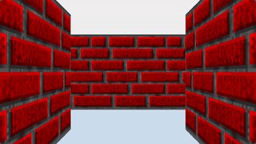

### Maze Walk Screensaver

Classic Windows 95 maze screensaver, made in C. Walls are projected following the Wolfenstein 3D ray casting algorithm.

NOTE: This example illustration is a GIF that I've rendered at a very low frame rate on purpose to keep the file size at an acceptable size. Actual animation runs at a butter-smooth 60+ FPS.

To-dos:

 - [X] Add WebAssembly as compilation target.
 - [ ] Generate different maze layouts procedurally.
 - [ ] Include more textures.
 - [ ] Toggle mini map on/off.
